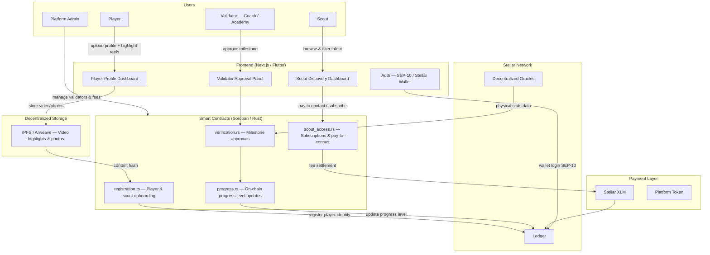
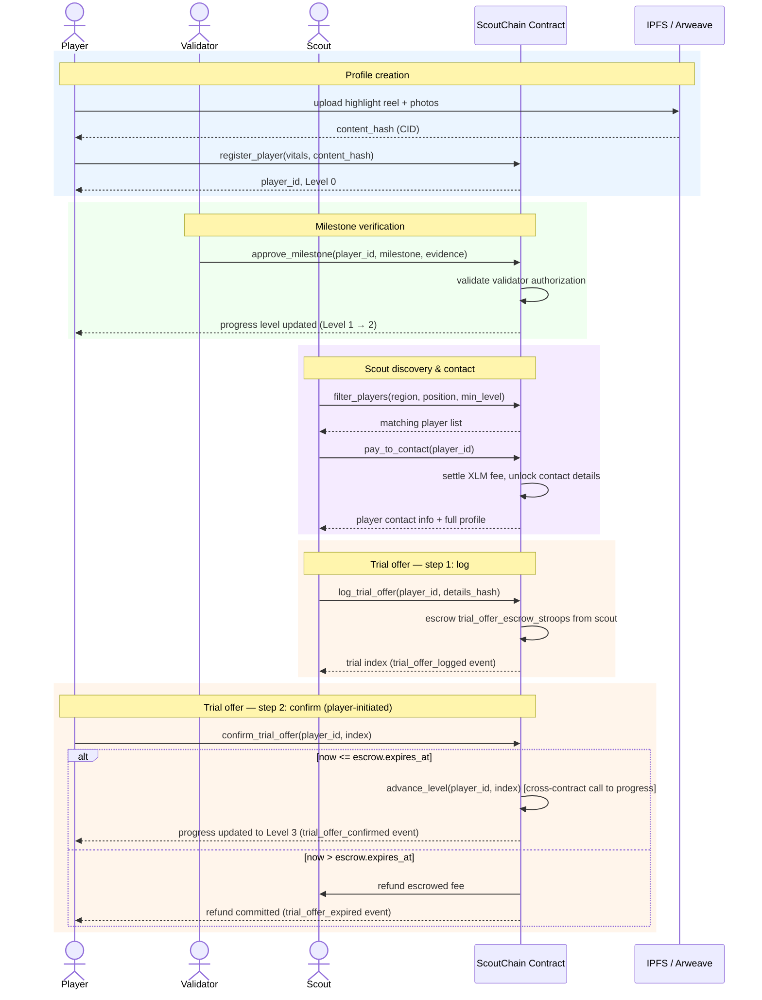

# ScoutChain

[](https://github.com/scout-off/scout-off-contracts/actions/workflows/contract-ci.yml)
[](https://github.com/scout-off/scout-off-contracts/actions/workflows/ci.yml)

Core Soroban (Rust) smart contracts powering the Scouting Platform on the Stellar network. Manages decentralized talent identities, maps tamper-proof progress metrics, handles validator verification signatures, and governs scout platform access.

## Overview

ScoutChain solves the visibility problem for undiscovered football talent worldwide. Players from underserved regions create dynamic on-chain profiles backed by verifiable milestones — approved by local coaches, academy directors, and certified trainers. Scouts browse a trusted, filterable talent pool and connect directly with players, with every interaction settled via Stellar's near-zero-cost payment layer.

Stellar is the backbone: transactions cost fractions of a cent and settle in 3–5 seconds, making microtransactions viable for scouts paying to unlock premium data or contact players across borders. Soroban smart contracts handle player registration, milestone verification, scout subscriptions, and secure connection agreements with auditable, tamper-proof logic.

## Features

- **Dynamic Player Profiles**: On-chain identity linked to highlight reels stored on IPFS/Arweave, with verified stats and vitals
- **Verifiable Progress Bar**: Milestones confirmed by authorized validators are written to the blockchain — no fake stats
- **Multi-Level Verification**: Four-tier trust system from unverified profile to elite scout-endorsed tier
- **Scout Discovery**: Filter players by region, position, and verified progress tier
- **Pay-to-Contact**: Scouts pay micro-fees in $XLM or platform token to unlock premium data or initiate contact
- **Validator Network**: Local coaches, academy directors, and certified trainers act as trusted on-chain validators
- **Wallet-Based Auth**: Players and scouts log in securely via Stellar wallets (Freighter, Albedo, or Lobstr) using SEP-10
- **Fractionalized Sponsorship** *(Future)*: Fans and local investors fund players via "Player Tokens" with transfer fee revenue sharing

## Architecture



### Core Components

- **registration.rs**: Handles player and scout onboarding, stores wallet address, IPFS content hashes, and basic vitals on-chain
- **verification.rs**: Processes milestone approval requests from authorized validators and emits verification events
- **progress.rs**: Manages the four-tier progress level system and updates player progress state on-chain
- **scout_access.rs**: Handles scout subscriptions, pay-to-contact flows, and connection agreement logic
- **storage.rs**: Persistent storage for player profiles, validator registry, and scout subscription records
- **events.rs**: Event emission for off-chain indexing (new profiles, milestone approvals, scout contacts)

### Progress Level Model

Progress levels are configured per player and enforced on-chain by authorized validators:

| Level | Name | Requirement |
|-------|------|-------------|
| 0 | Unverified | Player creates profile and uploads data |
| 1 | Verified Identity | KYC passed or academy confirms active club membership |
| 2 | Performance Milestones | Match footage or physical stats verified by approved third party; if `min_region_quorum` ≥ 2 is configured, approving validators must span at least that many distinct geographic regions |
| 3 | Elite Tier | Scout feedback or trial offers logged on-chain; same region-quorum requirement applies if configured |

## Tech Stack

| Layer | Technology | Purpose |
|-------|------------|---------|
| Smart Contracts | Soroban (Rust) | Player registration, progress verification, scout subscriptions, secure connection agreements |
| Frontend | React / Next.js or Flutter | Mobile/web interface for player uploads and scout talent browsing |
| Backend & Storage | Node.js + IPFS | Heavy video files and photos stored on IPFS; content hashes saved on-chain in player profiles |
| Auth SDK | Stellar SEP-10 | Secure wallet-based login for players and scouts via Freighter, Albedo, or Lobstr |

## Smart Contract Functions

### Player Functions

- `register_player(wallet, vitals, ipfs_hashes)` — Create a new on-chain player profile at Level 0
- `update_profile(player_id, ipfs_hashes)` — Update highlight reel or photo links (player auth required)
- `get_profile(player_id)` — Retrieve full player profile and current progress level

### Validator Functions

- `approve_milestone(validator_wallet, player_id, description, evidence_hash, milestone_category: Option<String>)` — Confirm a player achievement and trigger progress update (validator auth required). When `milestone_category` is supplied it must match one of the calling validator's specialization tags, otherwise the call is rejected with `SpecializationMismatch`.
- `register_validator(wallet, credentials, affiliation, specializations)` — Onboard a new coach, academy, or trainer as an authorized validator (admin auth required). `affiliation` is the canonical organization identifier used for diversity gating, while `specializations` is the optional list of category tags (for example `"physical-stats"` or `"identity-kyc"`) that gate milestone approval when `milestone_category` is set.
- `revoke_validator(wallet)` — Remove a validator from the trusted registry (admin auth required)

### Scout Functions

- `subscribe(scout_wallet, tier)` — Purchase a scout subscription to access filtered talent pool
- `pay_to_contact(player_id, scout_wallet)` — Pay micro-fee to unlock premium data or initiate direct contact
- `log_trial_offer(player_id, scout_wallet, details_hash)` — Record a trial offer on-chain and escrow the trial fee (step 1 of 2; does not advance the player's level)
- `confirm_trial_offer(player_wallet, player_id, index, idempotency_nonce)` — Player confirms a pending trial offer before it expires, releasing the escrow and advancing the player to Level 3 (step 2 of 2)

### Subscription Tier Access

Each tier controls which player progress levels a scout can view and what actions they can perform. These rules are enforced on-chain by the `scout_access` contract.

| Tier | Accessible Player Levels | Pay-to-Contact | Trial Offer (`log_trial_offer`) |
|------|--------------------------|----------------|---------------------------------|
| **Basic** | Level 0–1 (Unverified, VerifiedIdentity) | ❌ Not available | ❌ Not available |
| **Pro** | Level 0–2 (Unverified, VerifiedIdentity, PerformanceMilestones) | ✅ Available (contact fee applies) | ❌ Not available |
| **Elite** | Level 0–3 (all levels) | ✅ Available (contact fee applies) | ✅ Available (escrows a fee; advances player to Level 3 once the player calls `confirm_trial_offer`) |

**Notes:**
- A scout without any active subscription cannot call `pay_to_contact` — the contract returns `ScoutNotSubscribed` (code 6).
- An expired subscription is treated the same as no subscription — renew via `subscribe` before contacting players.
- `log_trial_offer` is restricted to **Elite** tier only; calling it with Basic or Pro returns `Unauthorized` (code 4).
- Basic tier scouts can browse and filter players at Level 1 (VerifiedIdentity) only — they cannot see Level 2 or Level 3 players, cannot contact players, and cannot make trial offers.
- Subscription downgrade to a lower tier is blocked while the current subscription is active (`SubscriptionDowngradeNotAllowed`, code 12).

### Admin Functions

- `initialize(admin, platform_token, fee_config)` — One-time contract setup
- `update_fee_config(fee_config)` — Adjust subscription and contact fee rates immediately, no delay (admin only)
- `propose_fee_config(fee_config)` / `activate_fee_config()` — Propose a new fee configuration; increases require a 7-day timelock before `activate_fee_config` takes effect, while pure decreases activate immediately (admin only)
- `withdraw_fees(to)` — Withdraw accumulated platform fees (admin only)
- `pause_contract()` / `unpause_contract()` — Emergency circuit breaker (admin only)
- `propose_admin(new_admin)` / `accept_admin()` — Rotate each contract's admin after the new address proves control
- `verify_scout(scout_id)` — Mark a scout profile as verified, gating Sybil-resistant discovery (admin only)
- `set_diversity_config(required_distinct_affiliations, starting_milestone_index)` / `get_diversity_config()` — Configure (or read) the minimum distinct validator-affiliation count required before a milestone counts toward level advancement (admin only to set)
- `set_min_region_quorum(min_regions)` — Set the minimum number of distinct validator regions required before Level-2/Level-3 advancement (admin only)
- `set_milestone_threshold(threshold)` — Set the k-of-n distinct-validator threshold required to commit an attested milestone claim (admin only)
- `set_voting_window_secs(window_secs)` — Set how long an attestation claim stays open for k-of-n voting before it expires (admin only)

### Query Functions

- `get_player(player_id)` — Full player profile with progress level and IPFS links
- `get_progress_history(player_id)` — Tamper-proof timeline of milestone approvals, returned in full. For players with very long histories, use the paginated getters below instead.
- `get_progress_history_page(player_id, offset, limit)` — Offset-based paginated history, `limit` capped at 50 entries per page
- `get_history_page_with_cursor(player_id, cursor_snapshot, cursor_next_index, limit)` — Cursor-based paginated history that snapshots the entry count on the first call, so pages stay consistent even if `advance_level` is called concurrently; `limit` capped at 50 entries per page
- `filter_players(region, position, min_level, offset, limit)` — Paginated scout discovery query; returns a `FilterResult` with a `profiles` page and a `next_cursor` (pass it back as `offset` to continue, `0` means no more results)
- `get_validators()` — Active validator registry
- `health()` — On-chain health check

## Progress Verification Flow

```
[ Player Uploads Video ]
         │
         ▼
[ Local Coach / Validator Approves ]
         │
         ▼
[ Soroban Smart Contract Updates Progress Level ] ──► [ Reflects on Scout Dashboard ]
```

### Milestone Examples

- "Scored 5 goals in Local Cup" → Level 2 milestone, approved by registered coach (untagged — any active validator)
- "Top speed clocked at 32 km/h" → Level 2 milestone, approved by certified trainer (`milestone_category: "physical-stats"` — only validators tagged for physical-stats)
- "Academy confirms active membership" → Level 1 milestone, approved by KYC agent (`milestone_category: "identity-kyc"` — only validators tagged for identity-kyc)
- "Trial offer received from FC Example" → Level 3 milestone, logged by scout via `log_trial_offer` and confirmed by the player via `confirm_trial_offer`

Validators are registered with an admin-set **affiliation** (canonical organization identifier, such as `"FC Example Academy"` or `"City Performance Lab"`) to gate diversity checks by distinct organizations. They also gain optional **specialization tags** (e.g. `"physical-stats"`, `"identity-kyc"`, `"match-performance"`) when registered. When `approve_milestone` is called with a `milestone_category`, the contract enforces that the validator holds a matching tag — preventing, for example, a pure identity-KYC agent from approving physical performance data. Untagged milestones (category omitted) remain open to any active validator, preserving backward compatibility.

## Player Lifecycle — Sequence Diagram



## Player Progress — State Machine

```
┌──────────────┐
│  Level 0     │  ← Profile created, data uploaded (Unverified)
└──────┬───────┘
       │
       ▼
┌──────────────┐
│  Level 1     │  ← Identity verified by academy or KYC
└──────┬───────┘
       │
       ▼
┌──────────────┐
│  Level 2     │  ← Performance milestones verified by approved third party
└──────┬───────┘
       │
       ▼
┌──────────────┐
│  Level 3     │  ← Trial offer logged by scout, then confirmed by player before expiry (Elite Tier)
└──────────────┘
```

### Valid Transitions

| From | To | Trigger |
|------|----|---------|
| Level 0 | Level 1 | Validator calls `approve_milestone` — identity confirmed |
| Level 1 | Level 2 | Validator calls `approve_milestone` — performance stats verified |
| Level 2 | Level 3 | Scout calls `log_trial_offer` (escrows a fee), then the **player** calls `confirm_trial_offer` before the escrow expires — trial or feedback recorded. A confirmation after expiry commits a refund to the scout and emits `trial_offer_expired`; the level does not advance. |

## Security Features

1. **Tamper-Proof History — independently verifiable, not just asserted**: Every milestone approval is an immutable on-chain transaction, and the progress contract additionally maintains a cryptographic Merkle commitment (`get_progress_root`) over each player's full history. Any caller — a light client, an off-chain indexer, a dispute-resolution process — can call `verify_history_proof` to check that a specific historical entry is genuinely part of the on-chain record, entirely on-chain, without trusting whichever Soroban RPC node served the query. See [Merkle history commitment](docs/CONTRACT_REFERENCE.md#merkle-history-commitment) for the construction.
2. **Authorized Validators Only**: Only admin-registered validators can approve milestones, preventing self-reported fake stats
3. **Atomic Fee Settlement**: Scout contact fees and token transfers settle in a single transaction. Every token-transfer call site (`subscribe`, `pay_to_contact`, `log_trial_offer` escrow, `confirm_trial_offer` expiry-refund, `withdraw_fees`, `refund_subscription`) is enumerated and proven atomic in [`contracts/scout_access/tests/atomic_fee_settlement.rs`](contracts/scout_access/tests/atomic_fee_settlement.rs) — if the XLM transfer fails, no storage mutation from that function persists.
4. **Authorization Checks**: All state-changing operations require proper Stellar account authorization
5. **Overflow Protection**: Safe arithmetic throughout all fee calculations
6. **Circuit Breaker**: Admin can pause the contract in an emergency without losing state

## Repository Structure

```
scout-off-contracts/
├── contracts/
│   ├── registration/       # Player & scout on-chain identity
│   ├── verification/       # Validator registry & milestone approvals
│   ├── progress/           # Four-tier level state machine
│   └── scout_access/       # Subscriptions, pay-to-contact, trial offers
├── bindings/               # Auto-generated TypeScript clients (post-deploy)
│   ├── registration/
│   ├── verification/
│   ├── progress/
│   └── scout_access/
├── migrations/
│   └── 001_initial_schema.sql   # PostgreSQL schema for the backend indexer
├── scripts/
│   ├── setup-testnet.sh    # One-command full testnet setup
│   ├── deploy.sh           # Build, optimize, and deploy all contracts
│   ├── initialize.sh       # Initialize contracts + wire cross-contract link
│   └── generate-bindings.sh # Generate TypeScript clients from deployed WASMs
├── testnet/
│   └── seed.sh             # Fund test accounts and register demo data
├── config/
│   ├── testnet.json        # Testnet RPC, Horizon, and token addresses
│   └── mainnet.json        # Mainnet config (fill in RPC key before use)
├── docs/
│   ├── DEPLOYMENT.md       # Step-by-step deployment guide
│   ├── CONTRACT_REFERENCE.md # Full function reference for all contracts
│   └── CONTRIBUTING.md     # PR checklist and contribution guidelines
├── .env.example            # Environment variable template
├── ai.md                   # Cross-repo integration guide for AI assistants
└── Cargo.toml              # Workspace manifest
```

## Quick Start

### One command (recommended)

```bash
cp .env.example .env
# Fill in all six environment variables from .env.example
./scripts/setup-testnet.sh
```

This runs all five steps automatically: build → deploy → initialize → generate bindings → seed demo data. Contract IDs are saved to `.env.contracts`, TypeScript bindings to `bindings/`, and test account addresses to `testnet/.accounts`.

If `setup-testnet.sh` fails partway through, keep the generated `.env.contracts` file from the deploy step and resume manually from the failed step below. For example, if initialization failed after deployment, run `./scripts/initialize.sh testnet`, then continue with `./scripts/generate-bindings.sh testnet` and `./testnet/seed.sh`.

### Manual setup

#### 1. Prerequisites

```bash
# Rust with WASM target
rustup target add wasm32-unknown-unknown

# Stellar CLI
# https://developers.stellar.org/docs/tools/developer-tools/cli/install-stellar-cli
```

#### 2. Configure environment

```bash
cp .env.example .env
# Fill in all six required environment variables
```

#### 3. Build and deploy

```bash
./scripts/deploy.sh testnet
# Contract IDs written to .env.contracts
```

#### 4. Initialize and wire contracts

```bash
./scripts/initialize.sh testnet
# Initializes all four contracts and establishes all eight cross-contract
# wiring links (see "Cross-Contract Wiring" below) so approve_milestone and
# confirm_trial_offer advance levels atomically
```

#### 5. Generate TypeScript bindings

```bash
./scripts/generate-bindings.sh testnet
# Bindings written to bindings/{contract}/
# Import these in the backend and frontend repos
```

#### 6. Seed demo data (optional)

```bash
./testnet/seed.sh
# Creates funded test player, two scouts, and two validators on testnet
```

> **Note on Funding**: Seeded demo accounts require a minimum balance of ~15 XLM to cover Stellar base reserves, registration, subscription purchases (up to 7 XLM for Elite tier), and pay-to-contact fees (0.1 XLM). Friendbot's standard testnet funding of 10,000 XLM per account is comfortably sufficient for the full demo flow.

## Cross-Contract Wiring

The four contracts hold **eight** peer-address pointers between them. `initialize.sh` establishes all eight automatically, and `./scripts/verify-cross-contract-wiring.sh <network>` checks them. The canonical list is in [`docs/WIRING_REGISTRY_DESIGN.md`](docs/WIRING_REGISTRY_DESIGN.md); `ai.md` carries the same table with the exact `stellar contract invoke` commands.

| # | Link | Purpose |
|---|------|---------|
| 1 | `verification` → `progress` | `approve_milestone` calls `advance_level` |
| 2 | `verification` → `registration` | dispute-milestone wallet-to-`player_id` binding check |
| 3 | `registration` → `progress` | `filter_players` resolves player levels at query time |
| 4 | `progress` → `verification` | whitelists verification as an `advance_level` caller |
| 5 | `progress` → `registration` | `progress` calls `set_player_level` on registration |
| 6 | `progress` → `scout_access` | whitelists scout_access as an `advance_level` caller |
| 7 | `scout_access` → `progress` | `confirm_trial_offer` calls `advance_level` for Level 3 |
| 8 | `scout_access` → `registration` | Pro-tier scout verification / Sybil gating lookups |

For example, the verification → progress link:

```bash
stellar contract invoke \
  --id $VERIFICATION_CONTRACT_ID \
  -- set_progress_contract \
  --progress_contract $PROGRESS_CONTRACT_ID
```

Without the full wiring, milestones and trial offers are recorded but player levels do not advance.

## TypeScript Bindings

After deployment, run `./scripts/generate-bindings.sh testnet` to produce auto-generated TypeScript clients in `bindings/`. The backend and frontend import these directly:

```typescript
import { Client as RegistrationClient } from "@scoutchain/bindings-registration";
import { Client as ProgressClient }     from "@scoutchain/bindings-progress";
```

See `bindings/README.md` for usage details.

## Database Schema

The `migrations/` directory contains the PostgreSQL migration files the backend event indexer needs. **Run every file in numeric order** — skipping any migration leaves tables, columns, or indexes missing and causes silent indexer errors at runtime.

`migrations/001_initial_schema.sql` creates the fourteen base PostgreSQL tables:

| Table | Purpose |
|-------|---------|
| `players` | Cached player profiles, indexed by region/position/level for fast filtering |
| `player_level_history` | Audit trail of level changes, tagged by source (`advance` vs admin `reset`) |
| `scouts` | Scout profiles |
| `validators` | Trusted validator registry |
| `validator_history` | Audit trail of validator restore and wallet-transfer events |
| `milestones` | Approved milestone records per player |
| `milestone_disputes` | Player-filed milestone disputes and their resolution status |
| `scout_subscriptions` | Active subscription records |
| `fee_config_history` | Audit trail of scout_access fee configuration changes |
| `contact_records` | Pay-to-contact audit log |
| `trial_offers` | On-chain trial offer records |
| `fee_withdrawals` | Platform fee withdrawal audit log |
| `admin_transfers` | Audit trail of admin rotations across contracts |
| `indexer_cursor` | Horizon event stream checkpoint (single row) |

Subsequent migrations add additional tables and columns:

| Migration | What it adds |
|-----------|-------------|
| `002_cursor_upsert_helper.sql` | `advance_indexer_cursor()` helper function |
| `003_diagnostic_events.sql` | `diagnostic_events` table |
| `004_scout_subscriptions_auto_renew.sql` | `auto_renew` column on `scout_subscriptions` |
| `005_evidence_access_grants.sql` | `evidence_access_grants` table |
| `006_dispute_jury.sql` | Jury columns on `milestone_disputes`; `dispute_votes` table |
| `007_milestone_flags.sql` | `milestone_flags` and `revocation_records` tables |

Run all migrations against your backend PostgreSQL instance:

```bash
psql $DATABASE_URL -f migrations/001_initial_schema.sql
psql $DATABASE_URL -f migrations/002_cursor_upsert_helper.sql
psql $DATABASE_URL -f migrations/003_diagnostic_events.sql
psql $DATABASE_URL -f migrations/004_scout_subscriptions_auto_renew.sql
psql $DATABASE_URL -f migrations/005_evidence_access_grants.sql
psql $DATABASE_URL -f migrations/006_dispute_jury.sql
psql $DATABASE_URL -f migrations/007_milestone_flags.sql
```

All migrations are idempotent and safe to re-run against an already-migrated database. See `migrations/README.md` for apply-order notes and file reference.

To verify this database's copy of on-chain state hasn't drifted from the
contracts, see [`scripts/reconcile-indexer.js`](scripts/reconcile-indexer.js)
and [docs/INDEXER.md](docs/INDEXER.md).

1. **Player Onboarding**
   - Connect Freighter wallet via SEP-10
   - Fill out profile: age, position, location, highlight reel links
   - Upload videos/photos to IPFS; content hashes saved on-chain
   - Profile starts at Level 0 (Unverified)

2. **Milestone Verification**
   - Local coach or academy director reviews footage or physical stats
   - Validator calls `approve_milestone` — transaction written to blockchain
   - Player's progress level updates automatically on the scout dashboard

3. **Scout Discovery**
   - Scout subscribes or pays per contact using $XLM or platform token
   - Filters talent by region, position, and minimum verified level
   - Views tamper-proof progress history before committing to a trial

4. **Trial & Elite Tier**
   - Scout logs a trial offer on-chain via `log_trial_offer`, escrowing the trial fee
   - Player calls `confirm_trial_offer` before the escrow expires to release the fee and advance to Level 3 (Elite Tier); a late confirmation refunds the scout instead
   - Connection agreement recorded as an immutable on-chain event

5. **Admin / Validator Management**
   - Admin registers trusted validators (coaches, academies, trainers)
   - Admin adjusts fee config and withdraws accumulated platform revenue
   - Emergency `pause_contract` available as a circuit breaker

## Configuration

Copy `.env.example` to `.env` and fill in all required values before running any script:

| Variable | Description |
|----------|-------------|
| `DEPLOYER_SECRET` | Stellar secret key used to deploy and invoke contracts |
| `ADMIN_ADDRESS` | Stellar G-address that will own all four contracts |
| `XLM_TOKEN_ADDRESS` | Native XLM token contract address on the target network |
| `STELLAR_NETWORK` | Target network: `testnet` or `mainnet` (default: `testnet`) |
| `HORIZON_URL` | Stellar Horizon endpoint for the target network |
| `SOROBAN_RPC_URL` | Soroban RPC endpoint for the target network |

Network-specific addresses are in `config/testnet.json` and `config/mainnet.json`.

After deployment, contract IDs are written to `.env.contracts` and must be copied into the backend and frontend repos:

```env
REGISTRATION_CONTRACT_ID=
VERIFICATION_CONTRACT_ID=
PROGRESS_CONTRACT_ID=
SCOUT_ACCESS_CONTRACT_ID=
```

### Mainnet Deployment Safety

When deploying to mainnet, **always verify** `config/mainnet.json` has been updated with real values before running `./scripts/deploy.sh mainnet`. The deployment script will reject the operation if placeholder values remain. Additionally:

1. Test the full deployment flow on testnet first
2. Verify all addresses in `.env` are correct for mainnet
3. Confirm `ADMIN_ADDRESS` is the intended account; later rotations use the two-step `propose_admin` + `accept_admin` flow on each contract
4. Double-check the `XLM_TOKEN_ADDRESS` matches the mainnet address (not testnet). The `scout_access.initialize` call now probes `xlm_token` by invoking `decimals()` on it and returns `InvalidInput` if the address is not a deployed token contract, so a wrong address (testnet SAC on mainnet, a typo, a plain account, or a non-token contract) is caught at deploy time rather than surfacing later as an opaque failure on the first `subscribe()` call.

## Testing

```bash
# Run all contract tests
cargo test --workspace

# Run with output (useful for debugging)
cargo test --workspace -- --nocapture

# Lint and format check
cargo clippy --workspace -- -D warnings
cargo fmt --all -- --check
```

Rather than maintaining a hand-curated checklist here, refer directly to the test suites in each contract's source tree. Each directory contains the full, up-to-date coverage picture:

| Directory | What it covers |
|-----------|----------------|
| `contracts/registration/src/lib.rs` (inline tests) | Player registration, scout registration, duplicate prevention, profile updates, admin initialization, field-validation guards |
| `contracts/verification/src/lib.rs` (inline tests) | Validator registry CRUD, milestone approval happy path, revoked/unregistered validator guards, evidence-hash storage, validator-cap enforcement |
| `contracts/progress/src/lib.rs` (inline tests) | Four-tier level state machine (Unverified → VerifiedIdentity → PerformanceMilestones → EliteTier), invalid-transition rejection, progress history recording, dispute-resolution level reset |
| `contracts/scout_access/src/lib.rs` (inline tests) | Scout subscriptions (Basic / Pro / Elite) with XLM fee settlement, pay-to-contact flow, duplicate-contact prevention, subscription-expiry enforcement, trial offer logging (Elite only), trial offer rejection for non-Elite, fee accumulation and admin withdrawal, pause / unpause circuit breaker, subscription downgrade guard, auto-renewal logic |
| `contracts/scout_access/tests/` | Integration tests for the full trial-offer flow across contract boundaries |
| `tests/` | Cross-contract event emission tests |

> **Note:** The workspace has known compile-blockers tracked in the "get the workspace green" umbrella issue. Test items that depend on features not yet merged should be treated as **not currently running** until that issue is resolved. Do not rely on this README as a statement of passing coverage — run `cargo test --workspace` and inspect the output directly.

## MVP Scope

The contracts shipped on testnet cover the following capabilities. This section reflects what is **currently implemented** in the contract source. It aligns with the Features list above and the checked items in the Roadmap below.

### Shipped contract features

- **Player & scout registration** — on-chain identity, IPFS hash storage, duplicate prevention, field validation
- **Validator registry** — admin-controlled register / revoke lifecycle, credential storage, validator-cap enforcement
- **Four-tier progress levels** — Unverified → VerifiedIdentity → PerformanceMilestones → EliteTier state machine with immutable on-chain history
- **Milestone approval** — validators confirm achievements with on-chain evidence hashes; cross-contract call atomically advances player level
- **Scout subscriptions** — Basic / Pro / Elite tiers with XLM fee settlement, expiry enforcement, downgrade guard, and auto-renewal
- **Pay-to-contact** — scouts pay a micro-fee to unlock contact details; duplicate-contact prevention; fee accumulation
- **Trial offer logging** — Elite-tier scouts record trial offers on-chain, advancing the player to Level 3 (EliteTier)
- **Admin controls** — fee-config management, fee withdrawal, and a contract-level circuit breaker (pause / unpause) on all four contracts
- **Event emission** — structured events for off-chain indexing on every state-changing operation
- **Deployment tooling** — build, deploy, initialize, cross-contract wiring, TypeScript binding generation, and one-command testnet setup
- **Backend schema** — PostgreSQL migration for the event-indexer backend

### Not yet started (future milestones)

The following are tracked in the Roadmap but have **no contract code today**:

- Fractionalized Player Token sponsorship model
- Decentralized oracle integration for physical stats
- Mobile-first Flutter frontend
- Security audit
- Mainnet launch

## Roadmap

- [x] Workspace scaffold — four Soroban contracts with full type, error, and event modules
- [x] Player & scout registration contract with duplicate prevention and IPFS hash storage
- [x] Validator registry with credential tracking and active/revoked state
- [x] Milestone approval with on-chain evidence hashes
- [x] Four-tier progress level state machine with immutable history
- [x] Cross-contract wiring — `approve_milestone` atomically calls `progress.advance_level`
- [x] Scout subscriptions (Basic / Pro / Elite) with XLM fee settlement
- [x] Pay-to-contact with duplicate prevention and fee accumulation
- [x] Trial offer logging (Elite tier only)
- [x] Admin fee withdrawal and circuit breaker on all contracts
- [x] Full unit test coverage across all four contracts
- [x] CI pipeline — build, test, clippy, and format check on every PR
- [x] Deployment scripts — deploy, initialize, wire, and one-command setup
- [x] TypeScript binding generation script
- [x] PostgreSQL migration schema for the backend event indexer
- [x] Testnet seed script with Friendbot-funded demo accounts
- [x] Network config files (testnet + mainnet)
- [x] Cross-repo `ai.md` integration guide
- [ ] Scout subscription and pay-to-contact flow (backend + frontend)
- [ ] Trial offer logging UI and Level 3 advancement (backend + frontend) — contract-side trial-offer escrow/confirmation is already shipped; remaining work is the backend/frontend UI layer.
- [ ] Decentralized oracle integration for physical stats
- [ ] Fractionalized Player Token sponsorship model
- [ ] Mobile-first Flutter frontend
- [ ] Security audit
- [ ] Mainnet launch

## Dependencies

- `soroban-sdk = "25.3.1"` — Soroban smart contract SDK (all four contracts)
- `stellar-cli` — Stellar CLI for deployment and contract invocation
- `wasm32v1-none` — Rust compilation target for Soroban WASM output

Frontend and backend dependencies live in their respective repos (`scoutchain-frontend`, `scoutchain-backend`).

## Error Codes

Each contract defines its own error enum. The same numeric code can mean different things in different contracts — always check which contract you are calling. See [`docs/CONTRACT_REFERENCE.md`](docs/CONTRACT_REFERENCE.md) for the full per-contract reference.

### `ScoutChainError` (registration contract)

| Code | Variant | Common Cause | Resolution |
|------|---------|--------------|------------|
| 1 | `AlreadyInitialized` | `initialize` called more than once | No action; contract is already ready |
| 2 | `NotInitialized` | Operation before `initialize` | Admin must call `initialize` first |
| 3 | `PlayerNotFound` | Invalid `player_id` | Verify the `player_id` from the registration transaction |
| 4 | `ValidatorNotAuthorized` | Unregistered account approving milestone | Admin must register the validator first |
| 5 | `InvalidProgressTransition` | Skipping or reversing a level | Follow valid 0→1→2→3 transition order |
| 6 | `ScoutNotSubscribed` | Scout has no subscription | Call `subscribe` with a valid tier and fee |
| 7 | `InsufficientFee` | Underpaying contact fee | Check current fee via `get_fee_config` |
| 8 | `AlreadyRegistered` | Wallet already has a profile for this role | Use the existing profile |
| 9 | `ContractPaused` | Circuit breaker is active | Wait for admin to call `unpause_contract` |
| 10 | `Unauthorized` | Wrong account for a privileged operation | Confirm you are using the correct Stellar account |
| 11 | `Overflow` | Counter or fee arithmetic overflowed | Use amounts within safe range |
| 12 | `ScoutNotFound` | Invalid `scout_id` | Verify the `scout_id` from the registration transaction |
| 13 | `InvalidInput` | Field too long, bad hash count, or empty value | Check field length limits in the function docs |
| 14 | `PendingAdminNotSet` | `accept_admin` called without a proposal | Call `propose_admin` first |
| 15 | `PlayerCapReached` | Player registration cap reached | Hard stop; no retry — the platform is full |
| 16 | `RegistrationCooldown` | Caller attempted to register again before the cooldown period elapsed | Wait for the cooldown window to pass, then retry |
| 17 | `PlayerRecordEvicted` | `restore_player_record` targeted a player entry whose archival grace period has fully elapsed | Unrecoverable; the record was evicted, not merely archived |
| 18 | `ScoutRecordEvicted` | `restore_scout_record` targeted a scout entry that has been fully evicted | Unrecoverable; the record was evicted, not merely archived |

### `VerificationError` (verification contract)

| Code | Variant | Common Cause | Resolution |
|------|---------|--------------|------------|
| 1 | `AlreadyInitialized` | `initialize` called more than once | No action; contract is already ready |
| 2 | `NotInitialized` | Operation before `initialize` | Admin must call `initialize` first |
| 3 | `ContractPaused` | Circuit breaker is active | Wait for admin to call `unpause_contract` |
| 4 | `Unauthorized` | Wrong account for a privileged operation | Confirm you are using the correct Stellar account |
| 5 | `ValidatorNotFound` | Wallet not in validator registry | Admin must call `register_validator` first |
| 6 | `ValidatorInactive` | Validator has been revoked | Contact admin to re-activate |
| 7 | `ValidatorAlreadyRegistered` | Wallet already registered as validator | Use the existing validator record |
| 8 | `PlayerNotFound` | Invalid `player_id` | Verify the `player_id` from the registration contract |
| 9 | `InvalidInput` | Bad evidence hash or credentials too long | Check CID format and byte limits |
| 10 | `ReasonTooLong` | Revocation reason exceeds 128 bytes | Shorten the reason string |
| 11 | `AlreadyConfigured` | `set_progress_contract` called twice | Use `update_progress_contract` for re-wiring |
| 12 | `ProgressCallFailed` | Cross-contract `advance_level` failed | Verify the progress contract is deployed and wired |
| 13 | `Overflow` | Milestone counter overflowed | Contact admin |
| 14 | `MilestoneNotFound` | Index out of range | Verify index against `get_milestone_count` |
| 15 | `ValidatorCapReached` | 100-validator platform limit reached | Contract upgrade required to raise the cap; contact admin |
| 16 | `DuplicateEvidence` | Evidence hash already used in a prior `approve_milestone` call | Use a unique evidence CID for each milestone approval |
| 17 | `MilestoneLimitExceeded` | Validator has already approved 5 milestones for this player | A different validator must approve further milestones for this player |
| 18 | `DisputeAlreadyResolved` | Dispute was already resolved and cannot be resolved again | No action; the dispute's outcome is final |
| 19 | `PendingAdminNotSet` | `accept_admin` called before an admin transfer was proposed | Call `propose_admin` first |
| 20 | `ApproveMilestonePaused` | `approve_milestone` is paused independently of the whole-contract pause | Wait for admin to unpause the function |
| 21 | `SpecializationMismatch` | `milestone_category` provided but the validator is not tagged for that category | Use a validator whose `specializations` includes the required category, or omit the category |
| 22 | `InvalidAttestation` | The ed25519 signature over the attestation payload failed verification, or its contract/network binding does not match this instance | Re-sign the payload with the registered attestation key for the correct contract and network |
| 23 | `AttestationKeyNotFound` | No attestation public key has been registered for this validator | Call `register_attestation_key` first |
| 24 | `InvalidNonce` | Attestation nonce is not strictly greater than the last accepted nonce | Query `get_attestation_nonce` and resubmit with a higher nonce |
| 25 | `RegistrationCooldown` | Validator registration attempted before the cooldown window elapsed | Wait for the cooldown window to pass, then retry |
| 26 | `DuplicateAttestation` | The same active validator has already attested to this exact `(player_id, evidence_hash)` claim in its current voting round | Wait for the round to resolve, or use a different validator |
| 27 | `TooManyPendingVotes` | This validator already has the maximum concurrent open (sub-threshold, unexpired) attestation votes outstanding | Wait for one of the validator's pending votes to resolve (commit or expire) before opening another |
| 28 | `ThresholdModeRequiresAttestation` | `approve_milestone` or `submit_attested_milestone` was called while `get_milestone_threshold() > 1` | Use `attest_milestone` — k-of-n mode has no single-signature bypass once the threshold is `>= 2` |
| 29 | `RegistrationCallFailed` | Cross-contract call to the registration contract failed | Verify the registration contract is deployed and wired |
| 30 | `MigrationNotActive` | Migration window is not currently active on this contract | Admin must call `open_migration_window` before seeding state |
| 31 | `MilestoneAlreadyExists` | A `Milestone` already exists at `(player_id, milestone_index)` with different content | Identical replays are no-ops; a conflicting replay must target a different index |
| 32 | `DisputeAlreadyExists` | A `MilestoneDispute` already exists at `(player_id, milestone_index)` with different content | Identical replays are no-ops; a conflicting replay must target a different index |
| 33 | `ValidatorRecordEvicted` | `restore_validator_record` targeted a validator entry whose archival grace period has fully elapsed | Unrecoverable; the record was evicted, not merely marked inactive |
| 34 | `MilestoneRecordEvicted` | `restore_milestone_record` targeted a milestone entry that has been fully evicted | Unrecoverable |
| 35 | `NotEligibleToReReview` | `rereview_milestone` called by a wallet that is not a currently-active validator (**not** 32/33 — see notes on issue #1197) | Only active, non-revoked validators may clear a pending re-review flag |
| 36 | `MilestoneNotFlagged` | `rereview_milestone` called on a milestone that is not currently flagged as pending re-review (**not** 32/33 — see notes on issue #1197) | No action; the flag either never existed or was already cleared by a prior call |
| 37 | `DisputeRequiresJury` | `resolve_dispute` called on a dispute that requires jury resolution | Use `tally_dispute` to finalize jury-required disputes |
| 38 | `NotJuryDispute` | `cast_dispute_vote` or `tally_dispute` called on a dispute not routed to the jury path | Use `resolve_dispute` for non-jury disputes |
| 39 | `VotingWindowClosed` | `cast_dispute_vote` called after the voting window has closed | The dispute must now be finalized via `tally_dispute` |
| 40 | `ConflictOfInterest` | `cast_dispute_vote` called by the validator who originally approved the disputed milestone | That validator cannot vote on this dispute; a different juror must vote |
| 41 | `AlreadyVoted` | `cast_dispute_vote` called by a validator who has already voted on this dispute | No action; one vote per validator per dispute |
| 42 | `VotingWindowOpen` | `tally_dispute` called before the voting window closes, with the vote count tied at or above quorum | Wait for the voting window to close before tallying a tied vote |
| 43 | `QuorumNotReached` | `tally_dispute` called before the voting window closes and the required quorum of votes has not yet been reached | Wait for more votes or for the voting window to close |

### `ProgressError` (progress contract)

| Code | Variant | Common Cause | Resolution |
|------|---------|--------------|------------|
| 1 | `AlreadyInitialized` | `initialize` called more than once | No action; contract is already ready |
| 2 | `NotInitialized` | Operation before `initialize` | Admin must call `initialize` first |
| 3 | `ContractPaused` | Circuit breaker is active | Wait for admin to call `unpause_contract` |
| 4 | `Unauthorized` | Wrong account for a privileged operation | Confirm you are using the correct Stellar account |
| 5 | `InvalidProgressTransition` | Level skip or reversal attempted | Follow valid 0→1→2→3 transition order |
| 6 | `AlreadyAtMaxLevel` | Player is already at `EliteTier` | No further advancement possible |
| 7 | `PlayerNotFound` | History index out of range | Verify index against `get_history_count` |
| 8 | `Overflow` | History counter overflowed | Contact admin |
| 9 | `RegistrationCallFailed` | Cross-contract call to registration contract failed | Verify the registration contract is deployed and wired |
| 10 | `PendingAdminNotSet` | `accept_admin` called without a prior `propose_admin` | Call `propose_admin` first, then have the proposed address call `accept_admin` |

### `ScoutAccessError` (scout_access contract)

| Code | Variant | Common Cause | Resolution |
|------|---------|--------------|------------|
| 1 | `AlreadyInitialized` | `initialize` called more than once | No action; contract is already ready |
| 2 | `NotInitialized` | Operation before `initialize` | Admin must call `initialize` first |
| 3 | `ContractPaused` | Circuit breaker is active | Wait for admin to call `unpause_contract` |
| 4 | `Unauthorized` | Wrong account or non-Elite tier for trial offer | Confirm account and subscription tier |
| 5 | `InsufficientFee` | Scout underpaid a subscription or contact fee | Send a payment that matches `FeeConfig` exactly |
| 6 | `ScoutNotSubscribed` | No subscription record found | Call `subscribe` with a valid tier and fee |
| 7 | `SubscriptionExpired` | Subscription past `expires_at` | Renew subscription via `subscribe` |
| 8 | `AlreadyContacted` | Duplicate `pay_to_contact` for same player | Contact is already unlocked |
| 9 | `InvalidTier` | Unknown subscription tier | Use `Basic`, `Pro`, or `Elite` |
| 10 | `Overflow` | Fee accumulation arithmetic overflowed | Contact admin |
| 11 | `TrialOfferNotFound` | Index out of range | Verify index against `get_trial_count` |
| 12 | `SubscriptionDowngradeNotAllowed` | Downgrade attempted while subscription is active | Wait for current subscription to expire |
| 14 | `ProgressCallFailed` | Cross-contract `advance_level` failed | Verify the progress contract is deployed and wired |
| 15 | `InvalidInput` | Zero or negative fee field in `FeeConfig` | All fee fields and `sub_duration_secs` must be > 0 |
| 16 | `NoFeesToWithdraw` | No accumulated fees to withdraw | Ensure fees have been collected before withdrawing |
| 17 | `UpgradeTooSoon` | `subscribe` called before minimum interval elapsed | Wait at least 1 hour between subscribe calls |
| 18 | `ContactQuotaExceeded` | Scout has hit the platform-wide contact quota for the current period | Wait for the quota window to reset or contact admin |
| 19 | `TrialOfferRateLimited` | Scout sent a trial offer to the same player within the cooldown window | Wait for the cooldown period to expire before retrying |
| 20 | `ProContactLimitReached` | Pro-tier scout has reached the `pro_contact_limit` contacts for the current subscription period | Upgrade to Elite (no limit applies) or wait for subscription to renew |
| 21 | `PendingAdminNotSet` | `accept_admin` called before an admin transfer was proposed | Call `propose_admin` first, then have the proposed address call `accept_admin` |
| 22 | `TrialOfferAlreadyConfirmed` | `confirm_trial_offer` called twice for the same offer | No action; the offer was already confirmed |
| 23 | `TrialOfferExpired` | Legacy error code retained for compatibility; expiry confirmation now commits the refund and returns success | Log a new trial offer after the refund event |

## Events

Comprehensive event reference is available in [`ai.md`](ai.md#events-reference). Below is a summary of the main events:

| Event | Emitted When |
|-------|-------------|
| `contract_initialized` | Contract initialization completes (registration, verification, progress, or scout_access) |
| `player_registered` | New player profile created on-chain |
| `validator_registered` | New validator registered in the verification contract |
| `milestone_approved` | Validator confirms a player achievement |
| `milestone_disputed` | Player files a dispute against an approved milestone |
| `dispute_resolved` | Admin resolves a milestone dispute |
| `validator_revoked` | Validator is deactivated by admin |
| `validator_restored` | Validator account is re-activated |
| `validator_transferred` | Validator wallet address is transferred to a new address |
| `progress_updated` | Player advances to a new level |
| `player_level_reset` | Admin resets player progress level (dispute resolution only) |
| `scout_subscribed` | Scout purchases a talent access subscription (legacy event, emitted alongside `subscription_created` or `subscription_renewed`) |
| `subscription_created` | Scout purchases their very first subscription |
| `subscription_renewed` | Scout renews or upgrades an existing subscription |
| `subscription_refunded` | Scout subscription refunded (e.g., downgrade or expiry) |
| `player_contacted` | Scout pays to unlock player contact details |
| `trial_offer_logged` | Scout records a trial offer and escrows the trial fee (does not advance the level) |
| `trial_offer_confirmed` | Player confirms a pending trial offer before its expiry window closes, releasing the escrow and advancing the player to Level 3 |
| `trial_offer_expired` | Trial offer confirmation window elapsed; escrowed fee refunded to scout |
| `fee_config_updated` | Admin updates subscription or contact fee rates |
| `fees_withdrawn` | Admin withdraws accumulated platform fees |
| `contract_paused` | Admin pauses the contract (circuit breaker activated) |
| `contract_unpaused` | Admin unpauses the contract (circuit breaker deactivated) |
| `admin_transfer_proposed` | Current admin proposes a replacement address |
| `admin_transferred` | Pending admin accepts control |
| `dispute_vote_cast` | A validator casts a vote on a jury-required milestone dispute |
| `dispute_tallied` | A jury dispute is closed with a final verdict (upheld or overturned) |
| `evidence_access_granted` | An `EvidenceAccessGrant` is issued to a scout via `pay_to_contact` / `batch_contact_players` |
| `evidence_access_revoked` | Admin revokes a scout's `EvidenceAccessGrant` via `admin_revoke_evidence_access` |

## Why Stellar

- Microtransactions: Scouts pay tiny fees to unlock data or contact players directly — no hefty banking fees across borders (e.g., a scout in Europe paying to contact a player in South America or Africa)
- Speed and Cost: Transactions cost fractions of a cent and settle in 3–5 seconds, ensuring a smooth experience for young players on mobile phones
- Fractionalized Sponsorship *(Future)*: Fans or local investors buy "Player Tokens" to fund a player's boots, travel, and training. If the player turns professional, a percentage of their transfer fee routes back to token holders via Stellar smart contracts

## License

MIT

## Documentation

- [docs/DEPLOYMENT.md](docs/DEPLOYMENT.md) — full deployment guide including mainnet checklist
- [docs/CONTRACT_REFERENCE.md](docs/CONTRACT_REFERENCE.md) — complete function reference for all four contracts
- [docs/CONTRIBUTING.md](docs/CONTRIBUTING.md) — PR checklist and contribution guidelines
- [docs/GLOSSARY.md](docs/GLOSSARY.md) — definitions of all domain-specific terms (scout, validator, milestone, CID, etc.)
- [ai.md](ai.md) — cross-repo integration guide for AI assistants and new team members

## Support

- GitHub Issues: [Create an issue](https://github.com/scout-off/scout-off-contracts/issues)
- **Security Reports**: See [SECURITY.md](SECURITY.md) for our security policy and private vulnerability reporting process
- Stellar Discord: https://discord.gg/stellar
- Stellar Developers: https://developers.stellar.org

## Contributing

See [docs/CONTRIBUTING.md](docs/CONTRIBUTING.md) for the full guide.

Quick checklist:
- All contract tests pass: `cargo test --workspace`
- Zero clippy warnings: `cargo clippy --workspace -- -D warnings`
- Formatting clean: `cargo fmt --all -- --check`
- New functions have tests and are documented in [docs/CONTRACT_REFERENCE.md](docs/CONTRACT_REFERENCE.md)
- Validator authorization logic changes require explicit review from a second team member
